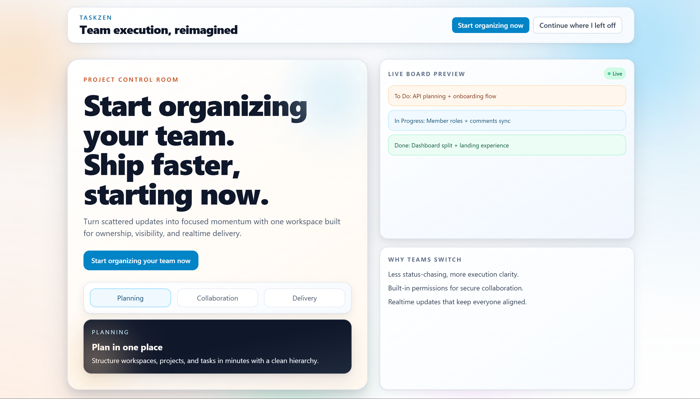
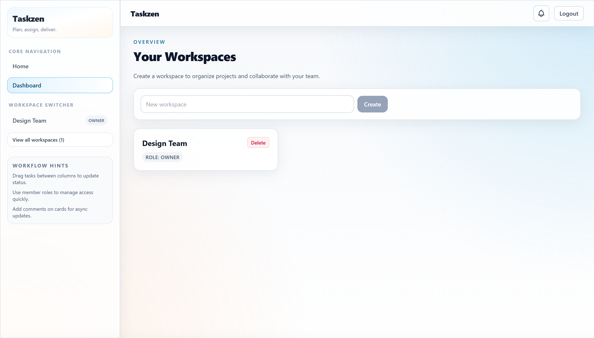
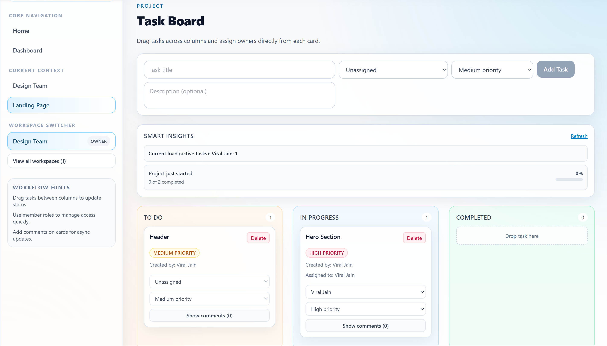

# Taskzen — Real-Time Collaborative Task Management SaaS


A production-grade MERN application featuring real-time collaboration, offline-first synchronization, and intelligent task insights.

🔗 Live Demo: https://taskzen-orpin.vercel.app/

---

## Key Highlights

- Real-time multi-user collaboration using Socket.IO
- Offline-first architecture with automatic sync on reconnect
- Smart Insights engine (overdue tasks, workload, project health)
- Multi-tenant workspace system with role-based access control
- Kanban board with drag-and-drop (dnd-kit)

---

## What Makes Taskzen Different?

Unlike basic task managers, Taskzen focuses on:

- Real-time multi-user synchronization
- Offline-first interaction model
- Built-in task intelligence (insights engine)

---

## Demo Preview

### Landing Page



### Dashboard



### Kanban Board & Insights



---

## Documentation Index

- [Getting Started](docs/GETTING_STARTED.md)
- [Architecture](docs/ARCHITECTURE.md)
- [API Reference](docs/API_REFERENCE.md)
- [Deployment](docs/DEPLOYMENT.md)
- [Troubleshooting](docs/TROUBLESHOOTING.md)
- [Backend README](backend/README.md)
- [Frontend README](frontend/README.md)

---

## Quick Start

1. Install dependencies:

```bash
cd backend
npm install

cd ../frontend
npm install
```

2. Create `backend/.env`:

```env
MONGO_URI_ATLAS=your_atlas_connection_string
MONGO_URI=mongodb://127.0.0.1:27017/taskzen
JWT_SECRET=your_jwt_secret
PORT=5000
```

3. Start backend:

```bash
cd backend
npm run dev
```

4. Start frontend:

```bash
cd frontend
npm run dev
```

5. Open:

- Frontend: http://127.0.0.1:5173
- Backend health: http://127.0.0.1:5000/

## Tech Stack

- Frontend: React 19, TypeScript, Vite, Tailwind, TanStack Query, Axios, dnd-kit, Socket.IO client
- Backend: Node.js, Express 5, MongoDB/Mongoose, JWT, Socket.IO, Zod validation

## Core Features

- Multi-workspace, role-based collaboration (`owner`, `admin`, `member`)
- Kanban task board with drag-and-drop
- Realtime task and comment updates over Socket.IO
- Offline queue and sync for task/comment actions
- Smart insights for project health and workload

## Notes

- Frontend dev server is pinned to port `5173` in [frontend/vite.config.ts](frontend/vite.config.ts).
- Backend API base is `/api` (for example: `http://127.0.0.1:5000/api/tasks/:projectId`).

## License

See [LICENSE](LICENSE).
